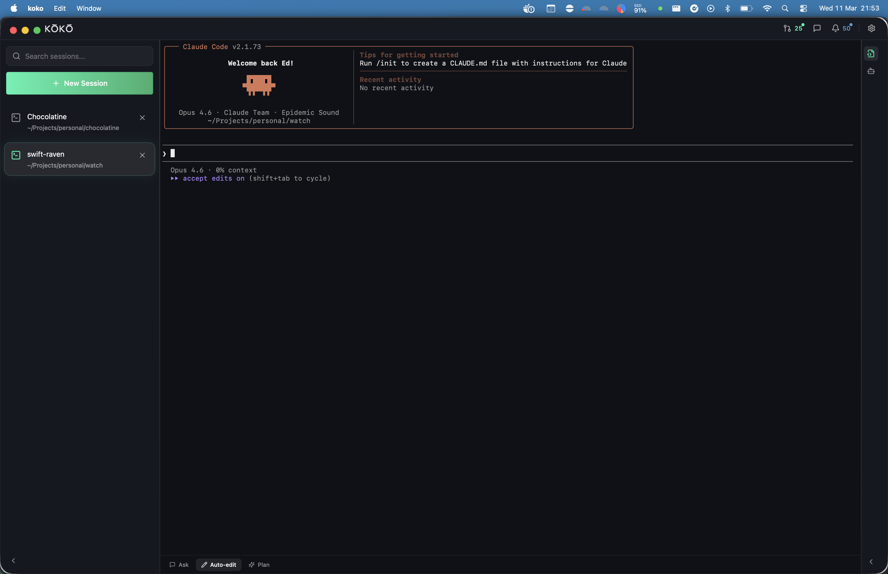
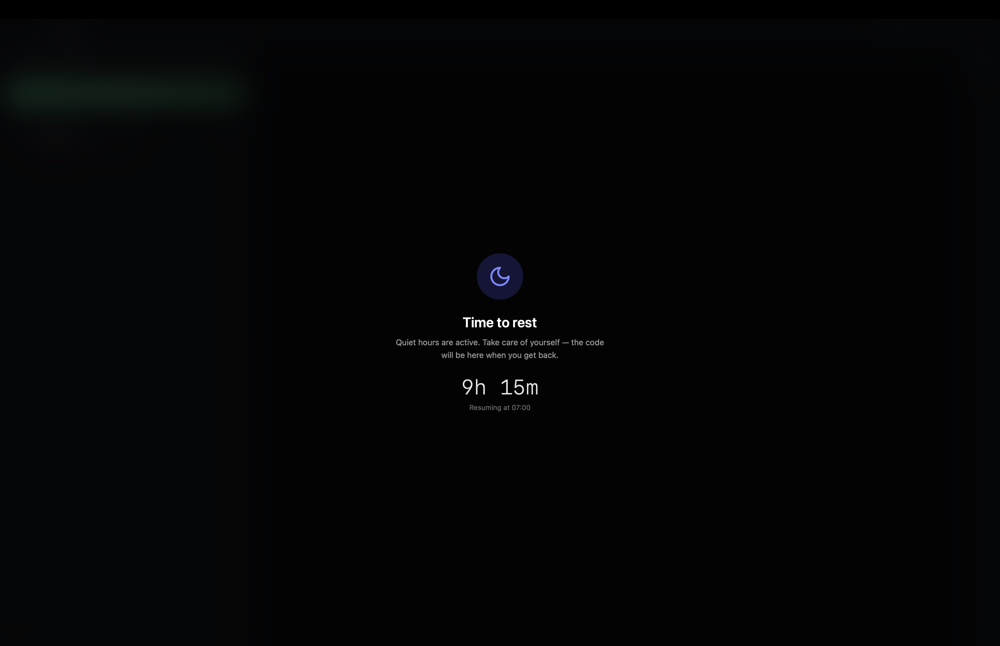
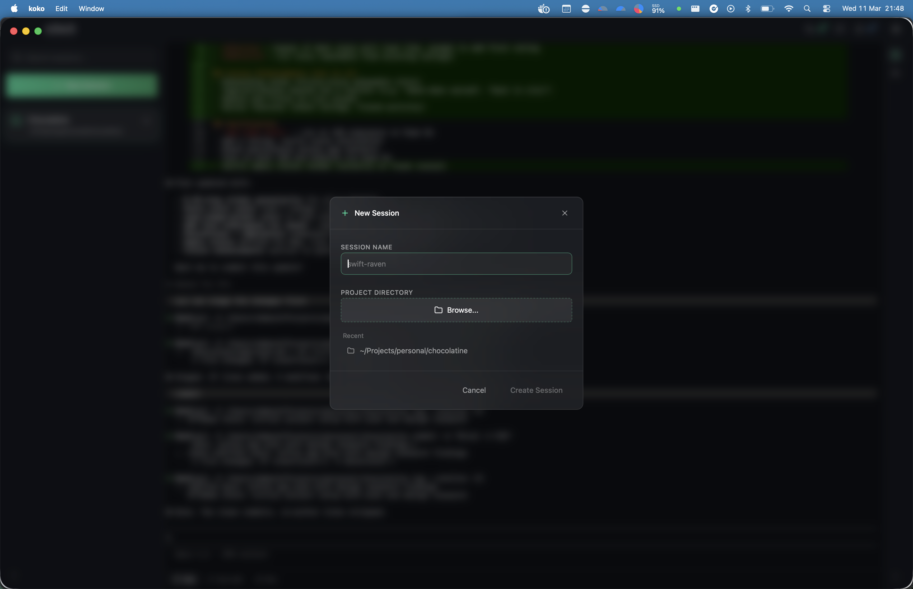

<p align="center">
  
</p>

<h1 align="center">Kõkõ</h1>

<p align="center">
  <strong>A desktop workspace for Claude Code</strong><br/>
  Run multiple Claude sessions side-by-side with GitHub PRs, git awareness, and remote access — all in one window.
</p>

<p align="center">
  <a href="https://github.com/edalee/koko/releases/latest"></a>
  <a href="LICENSE"></a>
  
</p>

<br/>

<p align="center">
  
</p>

---

## What is Kõkõ?

Kõkõ (named after the [Tui bird](https://en.wikipedia.org/wiki/Tui_(bird))) is a native desktop app that wraps Claude Code in a purpose-built workspace. Instead of juggling your terminal, GitHub, and Slack, Kõkõ keeps everything visible while you work.

Each session launches Claude Code in a directory you choose. The left sidebar shows your open sessions, and the right sidebar surfaces GitHub PRs, git file changes, and session context — so you never lose focus. A built-in API server lets you control sessions remotely from Claude Code (via MCP), a Slack bot, or the CLI.

## Features

### Claude Code Sessions
- **Named sessions** — Each session defaults to the directory name, or give it a custom name
- **Full interactive TUI** — Claude Code renders natively in xterm.js v6 with WebGL
- **Session persistence** — Sessions survive app restarts; reconnect with `claude --continue`
- **Session history** — Recently closed sessions shown in the new session dialog with last message preview
- **Context display** — Live context window usage percentage and model name per session
- **Approval detection** — Amber pulse on session icons when Claude is waiting for tool approval
- **Clipboard support** — `Cmd+C` (plain + HTML), `Cmd+Shift+C` (Markdown), right-click context menu
- **Keyboard shortcuts** — `Cmd+N` new session, `Cmd+W` close, `Cmd+1-9` switch

### Session Context
- **MCP Servers** — Connection status of configured MCP servers
- **Agents** — Built-in Claude agents with their models
- **Commands** — Project, global, and plugin slash commands — click to inject into the active terminal
- **Subagent Monitor** — See Claude's spawned child processes in real time

### Awareness Panels
- **GitHub PRs** — Live PR list from your repos with review status, approve/merge actions
- **GitHub Notifications** — Unread notifications with participating/all filter, mark-as-read
- **File Changes** — Git diff for the active session's directory (staged/unstaged), click to view full diff
- **Code Viewer** — GitHub-style split/unified diff with syntax highlighting

### Remote Access
- **HTTP API** — Control sessions, read output, and stream terminal data over REST/WebSocket on localhost
- **MCP Server** — Any Claude instance with the Koko MCP configured can list sessions, read output, send input, and manage files. Works with Claude Code, Claude in custom apps, Telegram bots, or any MCP-compatible client. Auto-registered on startup (`koko mcp`)
- **Slack Bot** — DM the bot: `sessions`, `status`, `send <slug> <text>` — owner-only access
- **CLI Companion** — `koko-cli sessions`, `koko-cli tail <slug>`, `koko-cli send <slug> <text>`

### Safe Working
- **Quiet Hours** — Set a time window (e.g. 23:00–07:00) when the app blocks access with a full-screen overlay
- **Break Reminders** — Configure a work/break cycle (e.g. 90 min work, 15 min break) with visual nudges

<p align="center">
  
</p>

### Workspace
- **Quick Terminal** — `Cmd+`` ` slides up a per-session zsh shell for quick commands
- **Glassmorphism UI** — Dark theme with frosted glass panels and mint accents
- **Auto-updates** — Checks for new releases and shows a toolbar notification

<p align="center">
  
</p>

## Install

### macOS (recommended: build from source)

The app is not notarized, and macOS XProtect removes unsigned binaries after first launch. Building from source avoids this entirely:

```bash
git clone https://github.com/edalee/koko.git
cd koko
make install-fe
make build
cp -R build/bin/Koko.app /Applications/
```

See [Build from Source](#build-from-source) for prerequisites.

### macOS (Homebrew)

Homebrew handles downloading and installing, but you'll need to reinstall after each launch until the app is [code-signed](https://developer.apple.com/developer-id/):

```bash
brew tap edalee/koko
brew install koko
```

Update or restore after XProtect strips the binary:

```bash
brew reinstall koko
```

> **First launch:** macOS may block the app — go to **System Settings → Privacy & Security → Open Anyway**.

### Linux

| Platform | Download |
|----------|----------|
| **Linux** (x86_64) | [Koko-vX.X.X-linux-x86_64.AppImage](https://github.com/edalee/koko/releases/latest) |

### Prerequisites

Kõkõ launches Claude Code for you, so you need it installed:

```bash
# Install Claude Code (requires Node.js)
npm install -g @anthropic-ai/claude-code
```

You also need an Anthropic API key or active Claude subscription configured for Claude Code.

### Optional Integrations

- **GitHub PRs** — Requires [`gh` CLI](https://cli.github.com/) authenticated (`gh auth login`)
- **Slack Bot** — Create a Slack app with bot scopes `im:history`, `im:read`, `chat:write` — see [Slack Bot Setup](docs/references/slack-bot-setup.md)
- **CLI Companion** — Build with `make build-cli`, reads config from `~/Library/Application Support/koko/cli.json`

## Build from Source

Requires Go 1.24+, Node.js 22+, and the [Wails CLI](https://wails.io/docs/gettingstarted/installation).

```bash
git clone https://github.com/edalee/koko.git
cd koko

# Install frontend dependencies
make install-fe

# Build production app bundle and install to /Applications
make build
cp -R build/bin/Koko.app /Applications/

# Build CLI companion
make build-cli

# Or run in development mode (hot reload)
make dev

# Run tests
make test
```

Locally-built binaries are not flagged by XProtect, so the app will persist across launches without issues. To update, `git pull` and rebuild.

## How It Works

Kõkõ is built with [Wails v2](https://wails.io/) — a Go backend connected to a React frontend running in a native webview.

```
                  ┌──────────────────────────────┐
                  │         Kõkõ (Wails)          │
                  │                               │
                  │  ┌───────────────────────────┐│
                  │  │  Go Backend               ││
                  │  │  PTY sessions, GitHub,    ││
                  │  │  git, config, Slack bot   ││
                  │  └─────────┬─────────────────┘│
                  │            │ Wails IPC         │
                  │  ┌─────────▼─────────────────┐│
                  │  │  React Frontend           ││
                  │  │  xterm.js, panels, overlays││
                  │  └───────────────────────────┘│
                  │                               │
                  │  ┌───────────────────────────┐│
                  │  │  API Server (:19876)      ││
                  │  │  HTTP + WebSocket         ││
                  │  └────────┬──────────────────┘│
                  └───────────┼───────────────────┘
                       ▲      │      ▲         ▲
                       │      │      │         │
                  Claude Code │  Slack bot   koko-cli
                  (MCP stdio) │  (polling)   (HTTP)
                              ▼
                        All services
```

- **Go backend** manages PTY sessions, GitHub API calls (via `gh`), git operations, Slack bot, Claude CLI parsing, and app config
- **React frontend** renders xterm.js terminals, glassmorphism panels, and overlay pages
- **Wails IPC** bridges Go ↔ JavaScript with type-safe bindings (Go structs become TypeScript classes)
- **PTY sessions** stream base64-encoded terminal data over Wails events
- **API server** exposes sessions, output, and git changes over HTTP/WebSocket for remote access
- **MCP server** (`koko mcp`) exposes 7 tools for session management — usable by any MCP-compatible Claude client (Claude Code, custom apps, bots)
- **Slack bot** listens for DMs from the configured owner and responds with session data
- **Go tests** cover API server, auth, MCP protocol, Slack commands, config, and subscriber fan-out
- **Vitest** tests guard against terminal resize and state regressions

## Tech Stack

| Layer | Technology |
|-------|-----------|
| Desktop shell | Wails v2 |
| Backend | Go 1.24 |
| Frontend | React 19, TypeScript |
| Terminal | xterm.js v6 + WebGL |
| Styling | Tailwind CSS v4, OKLCH dark theme |
| Testing | Go test, Vitest, React Testing Library |
| Remote API | net/http + gorilla/websocket |
| MCP | JSON-RPC 2.0 over stdio |
| CLI | koko-cli (Go, standalone binary) |
| Icons | Lucide React |
| Panels | react-resizable-panels |
| Code viewer | @git-diff-view/react + Shiki |
| PTY | creack/pty |

## Project Structure

```
main.go                    Wails entry point, MCP subcommand detection
app.go                     App lifecycle, API server, MCP registration, status line
terminal_manager.go        PTY session management, subscriber fan-out
api_server.go              HTTP/WebSocket API server (Bearer auth)
mcp_server.go              MCP stdio server (JSON-RPC 2.0)
mcp_tools.go               MCP tool definitions and dispatch
slack_commands.go           Slack bot DM command handler (owner-only)
claude_service.go          MCP servers, agents, commands, plugin skills
github_service.go          GitHub PR + notification fetching via gh CLI
git_service.go             Git file changes, branch info, file diffs
config_service.go          App config + API key + Slack bot persistence
process_monitor.go         Child process tree scanning for subagents
types.go                   Shared Go types
*_test.go                  Go tests (API, MCP, Slack commands, config, subscriber)

cmd/koko-cli/              CLI companion binary
  main.go                  Subcommand dispatch (sessions, status, send, output, tail, files)
  client.go                HTTP + WebSocket client
  config.go                Reads ~/Library/Application Support/koko/cli.json

frontend/src/
  App.tsx                  App shell with session sidebar + overlay routing
  globals.css              Glassmorphism theme tokens (OKLCH)
  components/
    Toolbar.tsx            Title bar with notification badges + update banner
    SessionSidebar.tsx     Session list with approval detection + inline rename
    RightSidebar.tsx       File changes, session context, subagent monitor
    TerminalPane.tsx       xterm.js terminal wrapper (one per session)
    QuickTerminal.tsx      Per-session slide-up zsh shell
    ClaudeModeSwitcher.tsx Context usage bar + mode buttons
    CodeViewer.tsx         GitHub-style split/unified diff overlay
    GitHubPanel.tsx        PR cards with approve/merge actions
    NotificationsPanel.tsx GitHub notifications with filter + mark-read
    NewSessionDialog.tsx   Session creation with history + directory picker
    SettingsPanel.tsx      Slack bot, safe working, remote API config
    SafeWorkingOverlay.tsx Quiet hours + break reminder overlays
    OverlayPage.tsx        Glassmorphism floating overlay wrapper
  hooks/
    useSessionTabs.ts      Session state, persistence, history
    useSessionActivity.ts  PTY activity monitoring + approval detection
    useSessionContext.ts   MCP servers, agents, commands fetching
    useFileChanges.ts      Git diff polling for active session
    useCodeViewer.ts       Diff data fetching + view mode state
    useSubagents.ts        Child process tree polling
    useGitHub.ts           PR fetching
    useNotifications.ts    GitHub notification fetching
    useSafeWorking.ts      Quiet hours + break timer logic
    useOverlay.ts          Floating overlay page management
    useKeyboardShortcuts.ts  Cmd+N/W/1-9 bindings
    useUpdateCheck.ts      Release update polling
  test/
    setup.ts               Vitest setup with Wails binding mocks
    terminal-resize-guard.test.tsx  Scroll position preservation tests
    quick-terminal-state.test.tsx   Per-session QT state tests
    session-activity.test.ts        Activity tracking tests

docs/
  plans/                   Implementation plans (001-018)
  architecture/            ADRs and design system
  references/              Setup guides (Slack bot)
```

## License

[Business Source License 1.1](LICENSE) — source available, non-competing production use allowed. Converts to GPL 2.0+ on 2030-02-27.

## Credits

Built by [Edward Lee](https://github.com/edalee).

Named after the [Tui](https://en.wikipedia.org/wiki/Tui_(bird)) (Prosthemadera novaeseelandiae) — a New Zealand songbird known for its complex vocalisations and iridescent plumage.
