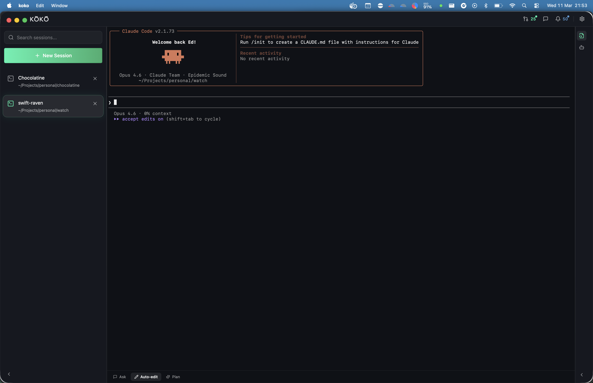
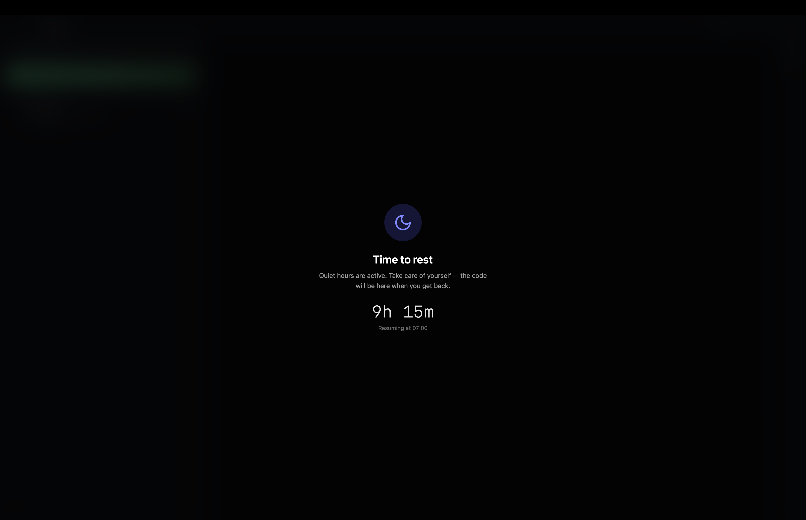
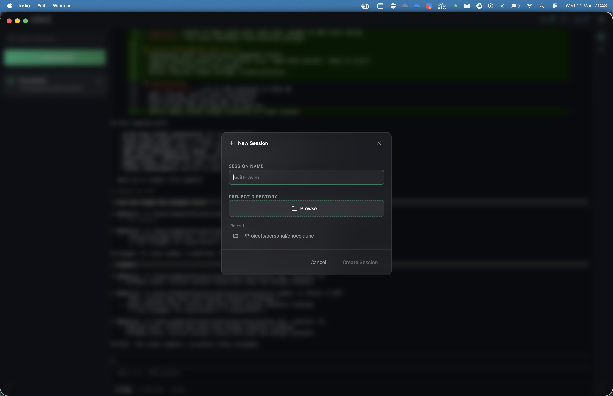

<p align="center">
  
</p>

<h1 align="center">Kõkõ</h1>

<p align="center">
  <strong>A desktop workspace for Claude Code</strong><br/>
  Run multiple Claude sessions side-by-side with GitHub PRs, git awareness, and remote access — all in one window.
</p>

<p align="center">
  <a href="https://github.com/edalee/koko/releases/latest"></a>
  <a href="LICENSE"></a>
  
</p>

<br/>

<p align="center">
  
</p>

---

## What is Kõkõ?

Kõkõ (named after the [Tui bird](https://en.wikipedia.org/wiki/Tui_(bird))) is a native desktop app that wraps Claude Code in a purpose-built workspace. Instead of juggling your terminal, GitHub, and Slack, Kõkõ keeps everything visible while you work.

Each session launches Claude Code in a directory you choose. The left sidebar shows your open sessions, and the right sidebar surfaces GitHub PRs, git file changes, and session context — so you never lose focus. A built-in API server lets you control sessions remotely from Claude Code (via MCP), a Slack bot, or the CLI.

## Features

### Claude Code Sessions
- **Named sessions** — Each session defaults to the directory name, or give it a custom name
- **Full interactive TUI** — Claude Code renders natively in xterm.js v6 with WebGL
- **Session persistence**: Sessions survive app restarts. Clicking a disconnected tab opens the session dialog with its conversation preselected, so Enter resumes it exactly with `claude --resume <id>`. The tab keeps its slug
- **Conversation picker**: After choosing a directory, pick a new conversation or reopen one Claude has stored for it, newest first, with its title and last reply. A conversation already open in another tab switches to that tab rather than opening twice
- **One tab per conversation**: Koko refuses to open a conversation another session already holds, whether from the UI, the API or MCP
- **Stable slugs**: A session keeps its slug (such as `koko-1`) across restarts, so the CLI, MCP and Slack always name the same session
- **Delete conversations**: Delete one conversation from the picker, or all of a directory's. Both confirm first, and skip any conversation a Koko tab holds or may be writing. A `claude` run outside Koko is not protected. Deleted conversations cannot be recovered
- **Housekeeping**: Settings > General clears Koko's session history, and removes the worktrees Koko created for closed sessions. Worktrees with uncommitted or ignored files stay
- **Session history**: Recently closed sessions shown in the new session dialog with last message preview. Choosing one reopens its conversation
- **Reload session**: Restart Claude in place from the sidebar row or the terminal's right-click menu, keeping the tab, slug and conversation. Useful after changing `CLAUDE.md` or an MCP server
- **Context display** — Live context window usage percentage and model name per session
- **Approval detection** — Amber pulse on session icons when Claude is waiting for tool approval
- **Clipboard support** — `Cmd+C` (plain + HTML), `Cmd+Shift+C` (Markdown), right-click context menu
- **Search Web**: Right-click selected terminal text to search it in your default browser
- **Redraw Terminal**: A right-click action that rebuilds a terminal whose text looks corrupt
- **Keyboard shortcuts** — `Cmd+N` new session, `Cmd+W` close, `Cmd+1-9` switch, `Cmd+,` Settings
- **Terminal search**: `Cmd+F` searches the terminal scrollback
- **Git worktrees**: The session dialog can create a worktree on a new branch, so parallel sessions on one repo stay apart. The Worktrees module lists, opens and removes them. Closing a session offers to remove the worktree Koko created for it

### Session Context
- **MCP Servers** — Connection status of configured MCP servers
- **Agents** — Built-in Claude agents with their models
- **Commands** — Project, global, and plugin slash commands — click to inject into the active terminal
- **Subagent Monitor** — See Claude's spawned child processes in real time

### Awareness Panels
- **GitHub PRs** — Live PR list from your repos with review status, approve/merge actions
- **Tracked repos**: Choose the repos Koko watches for PRs in Settings > GitHub
- **PR detail**: A full-screen overlay with the PR's files, diffs, reviews, commits and CI. You can read and reply to review threads and comments
- **CI status**: GitHub Actions runs for the active branch, in the File Changes module
- **GitHub Notifications** — Unread notifications with participating/all filter, mark-as-read
- **File Changes** — Git diff for the active session's directory (staged/unstaged), click to view full diff
- **Code Viewer** — GitHub-style split/unified diff with syntax highlighting
- **Raw file view**: Read a whole file with syntax highlighting. Binary files are detected, and a very large file asks before it renders

### Remote Access
- **HTTP API** — Control sessions, read output, and stream terminal data over REST/WebSocket on localhost
- **Resume by id**: `GET /api/sessions` lists each session's `claudeSessionId`. Pass one to `POST /api/sessions` (or `claude_session_id` to the MCP `create_session` tool) to reopen that conversation. Without an id, a session starts a fresh conversation
- **MCP Server** — Any Claude instance with the Koko MCP configured can list sessions, read output, send input, and list file changes. Works with Claude Code, Claude in custom apps, Telegram bots, or any MCP-compatible client. Auto-registered on startup (`koko mcp`)
- **Slack Bot** — DM the bot: `sessions`, `status`, `prompt <slug> <text>`, `send <slug> <text>`, `files`, `output`, `help` — owner-only access. The Slack tab in Settings is hidden, so the bot runs only if `config.json` already holds a bot token. It stays idle otherwise
- **CLI Companion** — `koko-cli sessions`, `koko-cli tail <slug>`, `koko-cli send <slug> <text>`

### Safe Working
- **Quiet Hours** — Set a time window (e.g. 23:00–07:00) when the app blocks access with a full-screen overlay
- **Break Reminders** — Configure a work/break cycle (e.g. 90 min work, 15 min break) with visual nudges

<p align="center">
  
</p>

### Worker (macOS)
- **koko-worker**: a background agent that runs scheduled work jobs on weekdays, even with the Koko window closed
- **Stand-up (07:00)**: one Slack DM with today's meetings, your PRs ready to merge with a Jira check, and PRs waiting for your review
- **Focus time (09:15)**: books "Focus" blocks in free calendar gaps of 30 minutes or more
- **Review worker (09:30, 12:00, 14:00)**: reviews each new PR once, yours from the last 14 days and the team's, and posts the review on the PR as you. A PR with nothing to report gets LGTM. One Slack line says each review is posted. The reviewer code comes from a managed clone of `epidemicsound/tonometer` at `main`, or a local path, set in Settings
- **Settings > Worker**: one switch for the worker, a switch and times per job, "Test" and "Run now" buttons, connection checks and the log
- **Catch-up and retries**: a job missed while the Mac slept runs on wake. A job waits for the internet, and gets 3 tries for other failures

### Workspace
- **Quick Terminal** — `Cmd+`` ` slides up a per-session zsh shell for quick commands
- **Glassmorphism UI** — Dark theme with frosted glass panels and mint accents
- **Auto-updates** — Checks for new releases and shows a toolbar notification

<p align="center">
  
</p>

## Install

### macOS (recommended: build from source)

The app is not notarized, and macOS XProtect removes unsigned binaries after first launch. Building from source avoids this entirely:

```bash
git clone https://github.com/edalee/koko.git
cd koko
make install-fe
make build
cp -R build/bin/Koko.app /Applications/
```

See [Build from Source](#build-from-source) for prerequisites.

### macOS (Homebrew)

Homebrew handles downloading and installing, but you'll need to reinstall after each launch until the app is [code-signed](https://developer.apple.com/developer-id/):

```bash
brew tap edalee/koko
brew install koko
```

Update or restore after XProtect strips the binary:

```bash
brew reinstall koko
```

> **First launch:** macOS may block the app — go to **System Settings → Privacy & Security → Open Anyway**.

### Linux

| Platform | Download |
|----------|----------|
| **Linux** (x86_64) | [Koko-vX.X.X-linux-x86_64.AppImage](https://github.com/edalee/koko/releases/latest) |

### Prerequisites

Kõkõ launches Claude Code for you, so you need it installed:

```bash
# Install Claude Code (requires Node.js)
npm install -g @anthropic-ai/claude-code
```

You also need an Anthropic API key or active Claude subscription configured for Claude Code.

### Optional Integrations

- **GitHub PRs** — Requires [`gh` CLI](https://cli.github.com/) authenticated (`gh auth login`)
- **Slack Bot** — Create a Slack app with bot scopes `im:history`, `im:read`, `chat:write` — see [Slack Bot Setup](docs/references/slack-bot-setup.md). The Slack tab in Settings is hidden for now, so the guide's Settings steps do not apply
- **CLI Companion** — Build with `make build-cli`, reads config from `~/Library/Application Support/koko/cli.json`
- **koko-worker** (macOS only): see [koko-worker setup](#koko-worker-setup)

### koko-worker setup

The worker uses launchd, `pmset` and `caffeinate`, so it runs on macOS only. `make build` puts `koko-worker` inside `Koko.app`. `make dev` builds it into `build/bin`.

It needs these connections. Settings > Worker checks each one and says how to fix a missing one.

- **Slack**: a bot token (`xoxb-`) with the `chat:write` scope, and your Slack user ID. The worker keeps its own Slack settings, apart from Koko's Slack bot.
- **GitHub**: the `gh` CLI, signed in with `gh auth login`.
- **Claude Code**: `claude` on the PATH, with the claude.ai Google Calendar and Atlassian connectors connected.
- **Reviewer**: nothing to set by default. The review worker keeps its own clone of `epidemicsound/tonometer` at `main` and updates it before each run. To run another reviewer, set a local path in Settings > Worker > Review worker.
- **Mac wake** (optional): a sudoers rule, so the worker can book wakes with `pmset`. The wake check shows the exact line to add with `sudo visudo -f /etc/sudoers.d/koko-worker`.

The switch in Settings > Worker installs the launchd agent `com.koko.worker`. The same switch removes it. You can also run `koko-worker install` and `koko-worker uninstall` by hand.

The worker keeps its settings in `~/Library/Application Support/koko/worker.json`. Its state and logs sit in `~/Library/Application Support/koko/worker/`. `logs/worker.log` moves to `worker.log.1` at 5 MB, so it stays under about 10 MB. Review run logs (`logs/tono-*.log`) are deleted after 60 days, when the state forgets the review. The PRs' repos are cloned to `~/.cache/koko-worker/repos`, and the managed reviewer to `~/.cache/koko-worker/reviewer`.

## Build from Source

Requires Go 1.24+, Node.js 22+, and the [Wails CLI](https://wails.io/docs/gettingstarted/installation).

```bash
git clone https://github.com/edalee/koko.git
cd koko

# Install frontend dependencies
make install-fe

# Build production app bundle and install to /Applications
make build
cp -R build/bin/Koko.app /Applications/

# Build CLI companion
make build-cli

# Build and test koko-worker (its own Go module, so it has its own targets)
make build-worker
make test-worker

# Or run in development mode (hot reload)
make dev

# Run tests
make test
```

Locally-built binaries are not flagged by XProtect, so the app will persist across launches without issues. To update, `git pull` and rebuild.

## How It Works

Kõkõ is built with [Wails v2](https://wails.io/) — a Go backend connected to a React frontend running in a native webview.

```
                  ┌──────────────────────────────┐
                  │         Kõkõ (Wails)          │
                  │                               │
                  │  ┌───────────────────────────┐│
                  │  │  Go Backend               ││
                  │  │  PTY sessions, GitHub,    ││
                  │  │  git, config, Slack bot   ││
                  │  └─────────┬─────────────────┘│
                  │            │ Wails IPC         │
                  │  ┌─────────▼─────────────────┐│
                  │  │  React Frontend           ││
                  │  │  xterm.js, panels, overlays││
                  │  └───────────────────────────┘│
                  │                               │
                  │  ┌───────────────────────────┐│
                  │  │  API Server (:19876)      ││
                  │  │  HTTP + WebSocket         ││
                  │  └────────┬──────────────────┘│
                  └───────────┼───────────────────┘
                       ▲      │      ▲         ▲
                       │      │      │         │
                  Claude Code │  Slack bot   koko-cli
                  (MCP stdio) │  (polling)   (HTTP)
                              ▼
                        All services
```

- **Go backend** manages PTY sessions, GitHub API calls (via `gh`), git operations, Slack bot, Claude CLI parsing, and app config
- **React frontend** renders xterm.js terminals, glassmorphism panels, and overlay pages
- **Wails IPC** bridges Go ↔ JavaScript with type-safe bindings (Go structs become TypeScript classes)
- **PTY sessions** stream base64-encoded terminal data over Wails events
- **API server** exposes sessions, output, and git changes over HTTP/WebSocket for remote access
- **MCP server** (`koko mcp`) exposes 8 tools for session management — usable by any MCP-compatible Claude client (Claude Code, custom apps, bots)
- **Slack bot** listens for DMs from the configured owner and responds with session data
- **koko-worker** runs apart from the app as a launchd agent. Through `worker_service.go`, the app edits `worker.json`, calls the `koko-worker` binary and reads the worker log
- **Go tests** cover API server, auth, MCP protocol, Slack commands, config, subscriber fan-out, conversation listing, conversation ownership and slugs
- **Vitest** tests guard against terminal resize and state regressions, and cover the session dialog, reconnect and reload

## Tech Stack

| Layer | Technology |
|-------|-----------|
| Desktop shell | Wails v2 |
| Backend | Go 1.24 |
| Frontend | React 19, TypeScript |
| Terminal | xterm.js v6 + WebGL |
| Styling | Tailwind CSS v4, OKLCH dark theme |
| Testing | Go test, Vitest, React Testing Library |
| Remote API | net/http + gorilla/websocket |
| MCP | JSON-RPC 2.0 over stdio |
| CLI | koko-cli (Go, standalone binary) |
| Icons | Lucide React |
| Panels | react-resizable-panels |
| Code viewer | @git-diff-view/react + Shiki |
| PTY | creack/pty |

## Project Structure

```
main.go                    Wails entry point, MCP subcommand detection
app.go                     App lifecycle, API server, MCP registration, status line
terminal_manager.go        PTY session management, subscriber fan-out
api_server.go              HTTP/WebSocket API server (Bearer auth)
mcp_server.go              MCP stdio server (JSON-RPC 2.0)
mcp_tools.go               MCP tool definitions and dispatch
slack_commands.go           Slack bot DM command handler (owner-only)
claude_service.go          MCP servers, agents, commands, plugin skills, stored conversations
github_service.go          GitHub PR + notification fetching via gh CLI
git_service.go             Git file changes, branch info, file diffs, worktrees
config_service.go          App config + API key + Slack bot persistence
process_monitor.go         Child process tree scanning for subagents
types.go                   Shared Go types
worker_service.go          Settings panel bridge to koko-worker (config, on/off, run, checks)
*_test.go                  Go tests (API, MCP, Slack commands, config, subscriber, conversations, ownership, slugs)

cmd/koko-cli/              CLI companion binary
  main.go                  Subcommand dispatch (sessions, status, send, output, tail, files)
  client.go                HTTP + WebSocket client
  config.go                Reads ~/Library/Application Support/koko/cli.json

cmd/koko-worker/           Scheduled work jobs (own Go module, launchd agent)
  main.go                  Subcommands: serve, run, check, status, install, uninstall
  scheduler.go             Due slots, catch-up, retries, state.json under a file lock
  jobs.go                  Stand-up, focus time and review jobs
  reviewer.go              The review worker's reviewer: managed clone or local path
  claude.go                Headless `claude -p` runner with allowlists
  calendar.go              Google Calendar events and the focus gap finder
  github.go                PR lists through gh
  slack.go                 Slack DMs in blocks
  launchd.go               Agent install and removal, Mac wake booking
  check.go                 Connection checks for the Settings panel
  config.go                worker.json, defaults and paths

frontend/src/
  App.tsx                  App shell with session sidebar + overlay routing
  globals.css              Glassmorphism theme tokens (OKLCH)
  components/
    Toolbar.tsx            Title bar with notification badges + update banner
    SessionSidebar.tsx     Session list with approval detection + inline rename
    RightSidebar.tsx       Modules: file changes (+ CI runs), session context, worktrees, notifications
    TerminalPane.tsx       xterm.js terminal wrapper (one per session)
    QuickTerminal.tsx      Per-session slide-up zsh shell
    ClaudeModeSwitcher.tsx Context usage bar + mode buttons
    CodeViewer.tsx         GitHub-style split/unified diff overlay
    PRDetailOverlay.tsx    Full-screen PR detail with approve/merge, comments and CI
    NotificationsPanel.tsx GitHub notifications with filter + mark-read
    SessionDialog.tsx      Start or recover a session: directory, history, worktree
    ConversationPicker.tsx New conversation or one of those stored for a directory
    WorktreesModule.tsx    Worktree list in the right sidebar: open or remove
    WorktreeRemovalDialog.tsx  Offers to remove Koko's worktree when its session closes
    ConfirmDialog.tsx      Confirmation dialog, for example before a reload
    SettingsPanel.tsx      Tabs: General (remote API), Safe working, GitHub, Worker. Slack tab hidden
    SafeWorkingOverlay.tsx Quiet hours + break reminder overlays
    OverlayPage.tsx        Glassmorphism floating overlay wrapper
    WorkerSettings.tsx     Worker tab in Settings: jobs, times, checks, log
  hooks/
    useSessionTabs.ts      Session state, persistence, history
    useSessionActivity.ts  PTY activity monitoring + approval detection
    useSessionContext.ts   MCP servers, agents, commands fetching
    useFileChanges.ts      Git diff polling for active session
    useCodeViewer.ts       Diff data fetching + view mode state
    useSubagents.ts        Child process tree polling
    useGitHub.ts           PR fetching
    useNotifications.ts    GitHub notification fetching
    useSafeWorking.ts      Quiet hours + break timer logic
    useOverlay.ts          Floating overlay page management
    useKeyboardShortcuts.ts  Cmd+N/W/1-9 bindings
    useUpdateCheck.ts      Release update polling
    useCI.ts               GitHub Actions runs for the active branch
    useWorktrees.ts        Worktree list for the Worktrees module
    useSessionBranches.ts  Current git branch per session directory
  test/
    setup.ts               Vitest setup with Wails binding mocks
    terminal-resize-guard.test.tsx  Scroll position preservation tests
    quick-terminal-state.test.tsx   Per-session QT state tests
    session-activity.test.ts        Activity tracking tests
    session-dialog.test.tsx         Session dialog and conversation picker tests
    reconnect-tab.test.tsx          Disconnected tab reconnect tests
    reconnect-message.test.ts       Reconnect error message tests
    reload-session.test.tsx         Reload session tests
    terminal-search-web.test.tsx    Search Web context menu tests

docs/
  plans/                   Implementation plans (001-029)
  architecture/            ADRs and design system
  references/              Setup guides (Slack bot)
```

## License

[Business Source License 1.1](LICENSE) — source available, non-competing production use allowed. Converts to GPL 2.0+ on 2030-02-27.

## Credits

Built by [Edward Lee](https://github.com/edalee).

Named after the [Tui](https://en.wikipedia.org/wiki/Tui_(bird)) (Prosthemadera novaeseelandiae) — a New Zealand songbird known for its complex vocalisations and iridescent plumage.
